# FieldTrack 2.0 Backend — Walkthrough

## Phase 0 — Project Scaffolding

Fastify + TypeScript backend scaffold with JWT, structured logging, modular routing, Docker, and domain placeholders. See [implementation_plan.md](file:///C:/Users/rajas/.gemini/antigravity/brain/b71c36fa-e873-458d-b1ea-7d1431f5f601/implementation_plan.md) for full details.

**Deviation:** replaced `ts-node-dev` with `tsx watch` (ESM compat) and added `pino-pretty` dev dep.

---

## Phase 1 — Secure Tenant Isolation Layer

### Files Changed / Created

| File | Action | Purpose |
|------|--------|---------|
| [jwt.ts](file:///d:/Codebase/FieldTrack-2.0/backend/src/types/jwt.ts) | **NEW** | Zod v4 schema for JWT payload (`sub`, `role`, `organization_id`) |
| [global.d.ts](file:///d:/Codebase/FieldTrack-2.0/backend/src/types/global.d.ts) | **MODIFIED** | Wires [JwtPayload](file:///d:/Codebase/FieldTrack-2.0/backend/src/types/jwt.ts#17-18) into Fastify types + adds `organizationId` to request |
| [auth.ts](file:///d:/Codebase/FieldTrack-2.0/backend/src/middleware/auth.ts) | **MODIFIED** | JWT verify → Zod validate → attach tenant context (or 401) |
| [tenant.ts](file:///d:/Codebase/FieldTrack-2.0/backend/src/utils/tenant.ts) | **NEW** | [enforceTenant()](file:///d:/Codebase/FieldTrack-2.0/backend/src/utils/tenant.ts#26-32) — scopes any query to `request.organizationId` |

### How Tenant Enforcement Works

```mermaid
sequenceDiagram
    participant Client
    participant Middleware as auth.ts
    participant Zod as jwt.ts (Zod)
    participant Handler as Route Handler
    participant DB as Supabase (future)

    Client->>Middleware: Request + JWT
    Middleware->>Middleware: jwtVerify() — signature check
    Middleware->>Zod: safeParse(decoded payload)
    alt Invalid claims
        Zod-->>Middleware: validation errors
        Middleware-->>Client: 401 + error details
    else Valid claims
        Zod-->>Middleware: typed JwtPayload
        Middleware->>Middleware: request.organizationId = payload.organization_id
        Middleware->>Handler: proceed
        Handler->>DB: enforceTenant(request, query)
        Note over DB: .eq("organization_id", request.organizationId)
        DB-->>Handler: tenant-scoped data only
    end
```

**Key guarantees:**
1. **No trust without validation** — decoded JWT is always schema-checked via Zod
2. **Tenant context is mandatory** — missing `organization_id` → 401
3. **Role enforcement** — only `ADMIN` or `EMPLOYEE` accepted
4. **Query-level isolation** — [enforceTenant()](file:///d:/Codebase/FieldTrack-2.0/backend/src/utils/tenant.ts#26-32) ensures all DB queries are org-scoped
5. **Type safety everywhere** — `request.user` and `request.organizationId` are fully typed

### Verification Results

| Check | Result |
|-------|--------|
| `npm run build` (tsc) | ✅ Zero errors |
| `npm run dev` (tsx watch) | ✅ Server starts on `0.0.0.0:3000` |
| `GET /health` | ✅ `{"status":"ok","timestamp":"..."}` |
